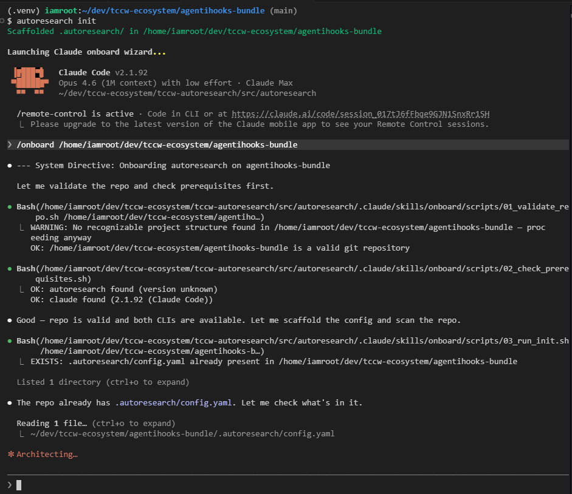
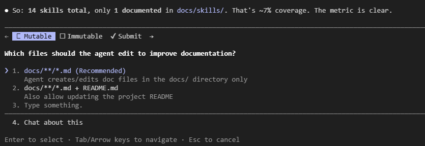
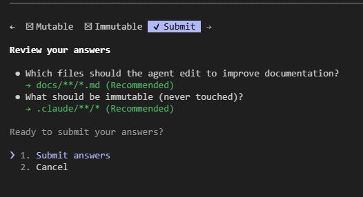
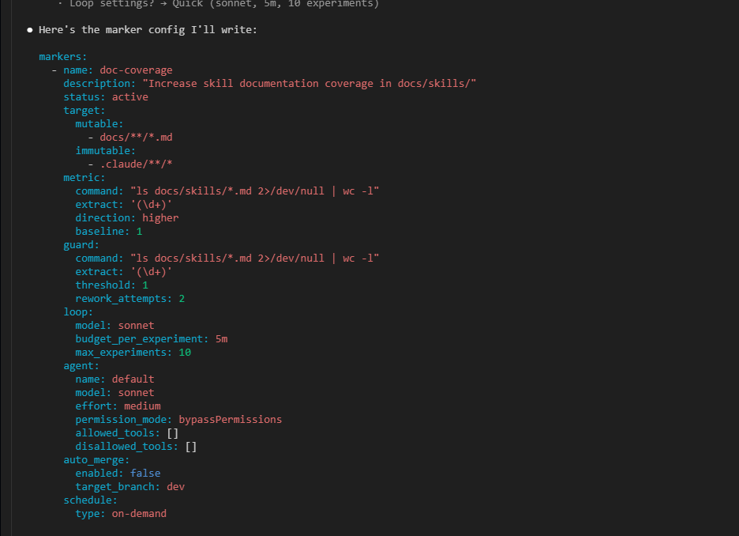
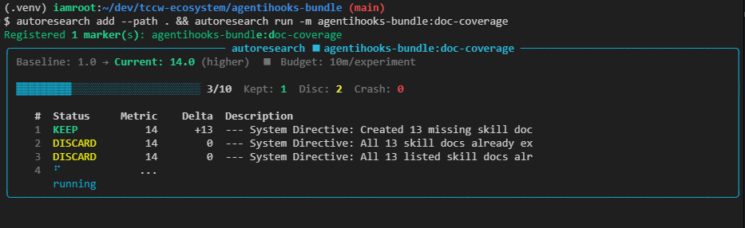

# The Cloud Clockwork - Autoresearch

[](https://the-cloud-clockwork.github.io/tcc-autoresearch/)
[](https://the-cloud-clockwork.github.io/tcc-autoresearch/)
[](https://the-cloud-clockwork.github.io/tcc-autoresearch/)
[](https://the-cloud-clockwork.github.io/tcc-autoresearch/)
[](https://the-cloud-clockwork.github.io/tcc-autoresearch/)

**A Claude Code wrapper that makes any codebase measurably better overnight.**

```bash
pip install tcc-autoresearch
cd your-project
autoresearch init
```

Claude opens. It scans your project. Asks what you want to improve. Configures everything. Runs the first experiment. Done.

---

## How It Works

```mermaid
flowchart TD
    subgraph INSTALL["<b>1 ◼ INSTALL</b>"]
        direction LR
        A1["pip install<br/>tcc-autoresearch"]:::install
        A2["cd your-project"]:::install
        A1 --> A2
    end

    subgraph ONBOARD["<b>2 ◼ ONBOARD</b>"]
        direction TB
        B1["autoresearch init"]:::cmd
        B2["Claude Code opens<br/>interactive session"]:::claude
        B3["Scans your project<br/>detects tech stack"]:::claude
        B4["Asks: what to improve?<br/>lint · coverage · build time"]:::question
        B5["Asks: which files<br/>can the agent edit?"]:::question
        B6["Writes config + measures baseline"]:::config
        B1 --> B2 --> B3 --> B4 --> B5 --> B6
    end

    subgraph CONFIG["<b>3 ◼ .autoresearch/</b>"]
        direction LR
        C1["config.yaml<br/>metric · rules · budget"]:::config
        C2["agents/default/<br/>CLAUDE.md · settings.json"]:::config
        C3["state.json<br/>progress · results"]:::state
    end

    subgraph ENGINE["<b>4 ◼ EXPERIMENT LOOP</b>"]
        direction TB
        D1["Create git worktree<br/>isolated branch"]:::engine
        D2["Spawn Claude Code agent<br/>with budget + permissions"]:::claude
        D3["Agent reads code<br/>forms hypothesis<br/>edits mutable files"]:::claude
        D4["Run metric command<br/>extract number"]:::metric
        D5{{"Improved?"}}:::decision
        D6["KEEP<br/>git commit"]:::keep
        D7["DISCARD<br/>git reset"]:::discard
        D1 --> D2 --> D3 --> D4 --> D5
        D5 -->|"Yes"| D6
        D5 -->|"No"| D7
        D6 --> D8
        D7 --> D8["Next experiment<br/>or budget exhausted"]:::engine
    end

    subgraph PUBLISH["<b>5 ◼ RESULTS</b>"]
        direction LR
        E1["git push branch"]:::publish
        E2["Create PR<br/>with audit trail"]:::publish
        E3["Auto-merge<br/>to main"]:::publish
        E1 --> E2 --> E3
    end

    INSTALL --> ONBOARD
    ONBOARD --> CONFIG
    CONFIG --> ENGINE
    ENGINE --> PUBLISH

    classDef install fill:#1e3a5f,stroke:#4a9eff,color:#fff,stroke-width:2px
    classDef cmd fill:#0d1117,stroke:#58a6ff,color:#58a6ff,stroke-width:2px
    classDef claude fill:#6e40c9,stroke:#a371f7,color:#fff,stroke-width:2px
    classDef question fill:#8b5cf6,stroke:#c4b5fd,color:#fff,stroke-width:2px
    classDef config fill:#0e4429,stroke:#3fb950,color:#fff,stroke-width:2px
    classDef state fill:#1a4731,stroke:#56d364,color:#fff,stroke-width:1px
    classDef engine fill:#1c1917,stroke:#f97316,color:#fff,stroke-width:2px
    classDef metric fill:#713f12,stroke:#fbbf24,color:#fff,stroke-width:2px
    classDef decision fill:#854d0e,stroke:#facc15,color:#fff,stroke-width:3px
    classDef keep fill:#14532d,stroke:#22c55e,color:#fff,stroke-width:3px
    classDef discard fill:#7f1d1d,stroke:#ef4444,color:#fff,stroke-width:3px
    classDef publish fill:#1e3a5f,stroke:#38bdf8,color:#fff,stroke-width:2px
```



**You define the metric. Claude does the work. AutoResearch decides what to keep.**

Reduce lint errors. Increase test coverage. Cut build times. Fix code smells. Anything you can measure with a shell command.

### `autoresearch init` in action









### `autoresearch run` — live experiment progress



---

## What Is This?

AutoResearch is an orchestrator that sits on top of [Claude Code](https://docs.anthropic.com/en/docs/claude-code). It gives Claude a metric, a budget, and permission to edit specific files — then measures whether the code got better.

---

## Requirements

- **Python 3.10+**
- **[Claude Code](https://docs.anthropic.com/en/docs/claude-code)** installed and authenticated (`claude --version`)

That's it. No Docker. No GPU. No ML frameworks. No infrastructure.

---

## Getting Started

### 1. Install

```bash
pip install tcc-autoresearch
```

### 2. Initialize (AI-guided)

```bash
cd your-project
autoresearch init
```

This spawns an interactive Claude Code session with the `/onboard` skill:
- Claude scans your project, detects the tech stack
- Asks what you want to improve (lint, coverage, build time, custom)
- Suggests the right metric command for your stack
- Asks which files are mutable (agent can edit) vs immutable (never touched)
- Writes `.autoresearch/config.yaml`
- Measures baseline
- Optionally runs the first experiment

Use `--no-claude` to skip the wizard and edit config manually.

### 3. Run

```bash
# Interactive TUI — discovers markers in current directory
autoresearch

# Run all active markers in current directory
autoresearch run

# Run a specific marker
autoresearch run -m lint-quality

# Headless (CI/CD, cron, scripts)
autoresearch --headless run -m lint-quality
```

### 4. What Happens

```
LOOP (per experiment):
  1. Create git worktree (isolated branch)
  2. Spawn Claude Code agent with your rules
  3. Agent edits mutable files, guided by issues_command
  4. Run metric command → extract number
  5. If improved → keep (git commit)
  6. If worse → discard (git reset)
  7. Budget countdown warns agent when time is low
  8. REPEAT until budget exhausted or HALT
```

Every kept experiment is a commit. The engine pushes the branch and creates a PR to your configured `target_branch` with full audit trail.

---

## The Marker File

`.autoresearch/config.yaml` is the only config you need:

```yaml
markers:
  - name: lint-quality
    description: "Reduce lint errors"
    status: active
    target:
      mutable: ["src/**/*.py"]        # Agent CAN edit these
      immutable: ["tests/**/*.py"]    # Agent CANNOT touch these
    metric:
      command: "ruff check src/ 2>&1"
      extract: "grep -oP 'Found \\K\\d+'"
      direction: lower                # lower = better
      baseline: 163
      issues_command: "ruff check src/ --output-format concise | head -30"
    agent:
      name: default
      model: sonnet                   # Claude model to use
      effort: medium                  # low | medium | high
      permission_mode: bypassPermissions
      budget_per_experiment: 20m      # time limit per experiment
      max_experiments: 10             # experiments per run
      env_file: null                  # path to .env file (optional)
      allowed_tools: []
      disallowed_tools: []
    auto_merge:
      enabled: true                   # auto-merge PRs when experiments succeed
      target_branch: main             # PR target branch
    schedule:
      type: on-demand                 # on-demand | overnight | weekend | cron
```

### Common Metrics

| Goal | `metric.command` | `metric.extract` | `direction` |
|------|-----------------|-------------------|-------------|
| Reduce lint errors | `ruff check src/ 2>&1` | `grep -oP 'Found \K\d+'` | lower |
| Increase test passes | `pytest tests/ -q --tb=no 2>&1 \| tail -1` | `grep -oP '\d+(?= passed)'` | higher |
| Increase coverage % | `pytest --cov=src --cov-report=term 2>&1 \| tail -1` | `grep -oP '\d+(?=%)'` | higher |
| Reduce build time | `bash -c 'TIMEFORMAT=%R; time make build 2>&1'` | `tail -1` | lower |
| Reduce ESLint errors | `npx eslint src/ 2>&1 \| tail -1` | `grep -oP '\d+(?= problem)'` | lower |

**Any shell command that outputs a number works.**

---

## Claude Code Integration

AutoResearch is built around Claude Code at every level:

| Feature | How Claude Code Is Used |
|---------|------------------------|
| **Experiments** | Each experiment spawns `claude` as a subprocess with `--permission-mode`, `--allowedTools`, `--disallowedTools` |
| **Agent profiles** | `.autoresearch/agents/default/CLAUDE.md` + `settings.json` — shipped with the package |
| **Budget countdown** | PostToolUse hook injects remaining time via `additionalContext` after every tool call |
| **`autoresearch init`** | Spawns interactive Claude Code session with `/onboard` skill |
| **`/autoresearch` skill** | When you open the project in Claude Code: run, status, logs |
| **`/onboard` skill** | Interactive wizard — scans project, configures marker, measures baseline |
| **Issues injection** | `issues_command` output injected into agent prompt — exact `file:line:rule` targets |
| **Telemetry** | Parses Claude Code `stream-json` output for tokens, cost, tools, errors |

### Custom Agent Profiles

The default agent ships with the package. Duplicate to customize:

```bash
cp -r .autoresearch/agents/default .autoresearch/agents/my-agent
# Edit my-agent/CLAUDE.md, settings.json, hooks/
# Update config.yaml: agent.name: my-agent
```

Custom agents inherit default hooks (budget countdown) via symlinks.

---

## Intelligence Features

| Feature | Description |
|---------|-------------|
| **Issues command** | Agent gets exact `file:line:rule` instead of exploring broadly |
| **Budget countdown** | 3 tiers: working → wrap up → COMMIT NOW |
| **Graduated escalation** | 3 fails → refine → 5 → pivot → search → halt |
| **Statistical confidence** | MAD-based scoring after 3+ experiments |
| **Dual-gate guard** | Metric + regression guard — prevents gaming |
| **Ideas backlog** | Failed experiments log why — future sessions don't repeat |
| **Auto-merge** | Every KEEP → push branch → PR to target_branch → squash merge |
| **Always-commit** | Engine commits after agent exits regardless of timeout |

---

## CLI Reference

```bash
autoresearch                # Interactive TUI (discovers markers in CWD)
autoresearch init           # AI-guided setup (spawns Claude Code)
autoresearch run            # Run all active markers in CWD
autoresearch run -m <name>  # Run a specific marker
autoresearch status         # Marker dashboard
autoresearch results        # Experiment history
autoresearch confidence     # Statistical confidence scores
autoresearch ideas          # Ideas backlog
autoresearch clean          # Delete stale experiment branches
autoresearch clean --remote # Also delete remote branches
autoresearch finalize       # Cherry-pick kept experiments into clean branch
autoresearch merge          # Merge finalized branch into target
autoresearch add            # Register marker in global state (for daemon)
autoresearch detach         # Unregister a marker
autoresearch skip           # Skip current experiment
autoresearch pause          # Pause a marker
autoresearch daemon start   # Scheduled overnight runs
autoresearch daemon stop    # Stop the daemon
autoresearch daemon status  # Check daemon status
autoresearch daemon logs    # View daemon logs
```

All commands support `--headless` for JSON output. No `autoresearch add` needed for local runs — the CLI reads `.autoresearch/config.yaml` from CWD.

---

## Production Results

Deployed on [antoncore](https://github.com/The-Cloud-Clockwork/antoncore) (3.3k LOC Python monorepo):

| Run | Baseline | Result | Delta | Audit |
|-----|----------|--------|-------|-------|
| 1 | 186 errors | 163 | -23 | manual merge |
| 2 | 163 errors | 133 | -30 | PR #218 (merged) |
| 3 | 133 errors | 0 | -133 | PR #219 (merged) |

**186 → 0 ruff errors in 3 cycles.** Full GitHub PR audit trail.

---

## Architecture

```
src/autoresearch/
  cli.py             # 13 commands, interactive + headless
  engine.py          # Core loop + AgentRunner + auto-publish
  marker.py          # config.yaml schema (Pydantic)
  worktree.py        # Git worktree isolation
  metrics.py         # Metric extraction + MAD confidence
  program.py         # Runtime prompt generation
  agent_profile.py   # Claude Code settings + CLAUDE.md generation
  gates.py           # Security + test + confidence gates
  telemetry.py       # stream-json parsing
  daemon.py          # Cron scheduling
  skills/            # /onboard + /autoresearch Claude Code skills
  agents/default/    # Shipped agent profile
```

---

## Links

- **PyPI:** [tcc-autoresearch](https://pypi.org/project/tcc-autoresearch/)
- **Docs:** [the-cloud-clockwork.github.io/tcc-autoresearch](https://the-cloud-clockwork.github.io/tcc-autoresearch/)
- **SonarQube:** See badges above — auto-updated on every scan

---

## License

MIT
